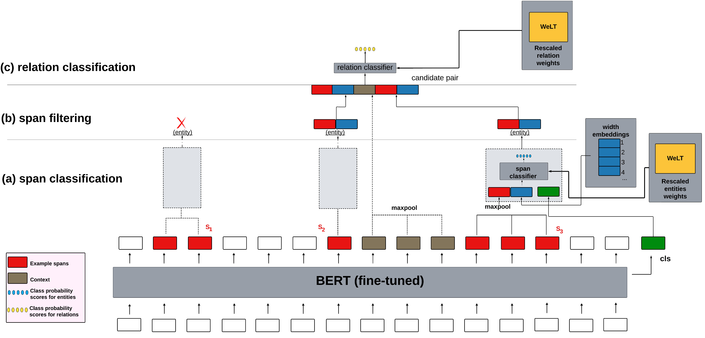

# WeLT-SpERT: Span-based Joint Named Entity and Relation Extraction Using WeLT
Authors: Ghadeer Mobasher*, Olga Krebs, Wolfgang Müller, and Michael Gertz 



## Installation 
**Dependencies**
Please make sure to install all required [dependencies](https://github.com/mobashgr/WeLT-SpERT/requirements.txt).

## Data Preparation
-Fetch Data :
 ```
bash ./scripts/fetch_datasets.sh
```
## Examples
(1) Train CoNLL04 on train dataset, evaluate on dev dataset:
```
python ./spert.py train --config configs/example_train.conf
```

 ## Citation
 The manuscript is in preparation (TBD)

## References
Markus Eberts, Adrian Ulges. Span-based Joint Entity and Relation Extraction with Transformer Pre-training. 24th European Conference on Artificial Intelligence, 2020.

## Acknowledgment
Ghadeer Mobasher* is part of the [PoLiMeR-ITN](http://polimer-itn.eu/) and is supported by the European Union’s Horizon 2020 research and innovation program under the Marie Skłodowska-Curie grant agreement PoLiMeR, No 812616.
